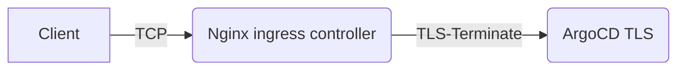
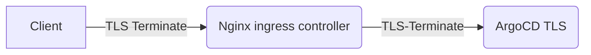

### Tình huống lỗi gặp phải
https://argo-cd.readthedocs.io/en/latest/operator-manual/ingress/#kubernetesingress-nginx

### Cách giải 1:
Sơ đồ  


TLS sẽ terminate lại ArgoCD server với annotations ssl-passthrough.
Vậy ta phải cấu hình TCP Stream mode trên [Nginx Baremetal] 

```console
apiVersion: networking.k8s.io/v1
kind: Ingress
metadata:
  name: argocd-server-ingress
  namespace: argocd
  annotations:
    nginx.ingress.kubernetes.io/force-ssl-redirect: "true"
    nginx.ingress.kubernetes.io/ssl-passthrough: "true"
spec:
  ingressClassName: nginx
  rules:
  - host: argocd.example.com
    http:
      paths:
      - path: /
        pathType: Prefix
        backend:
          service:
            name: argocd-server
            port:
              name: https
```
*Chú Ý: [port:\ name: https] Không phải là giao thức HTTPS mà chỉ là port 443 only

### Cách giải 2 (tốt hơn):
https://argo-cd.readthedocs.io/en/latest/operator-manual/ingress/#ssl-passthrough-with-cert-manager-and-lets-encrypt

Sơ đồ  



```console
apiVersion: networking.k8s.io/v1
kind: Ingress
metadata:
  name: argocd-server-ingress
  namespace: argocd
  annotations:
    nginx.ingress.kubernetes.io/ssl-passthrough: "true"
    nginx.ingress.kubernetes.io/backend-protocol: "HTTPS"
spec:
  ingressClassName: nginx
  rules:
  - host: argocd.example.com
    http:
      paths:
      - path: /
        pathType: Prefix
        backend:
          service:
            name: argocd-server
            port:
              name: https
  tls:
  - hosts:
    - argocd.example.com
    secretName: argocd-server-tls # as expected by argocd-server
```
nginx.ingress.kubernetes.io/backend-protocol: "HTTPS"  
Option này


