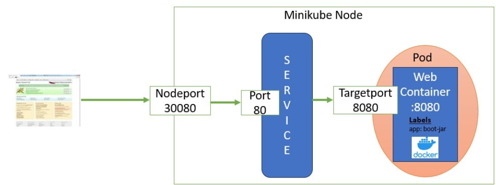

## Mô Tả
Có 4 loại svc:
- ClusterIP: dùng để các pod gọi nhau qua \$(svc_name).$(name_space).svc.cluster.local
- NodePort: listen port trên mỗi worker node.
- LoadBalancer: tạo IP mới loadbalancer
- ExternalName: Ánh xạ tới DNS ngoài giống CNAME hoặc 1 svc khác namespace

### 1.Cluster IP / NodePort
Compare --port and --target-port



### 2.LoadBalancer
Tham khảo: [Metal-LB](https://github.com/nguyenan122/k8s-self-learn/tree/develop/MetalLB)

### 3.ExternalName
Ví dụ về gọi inside cluster, khác namespace
```console
apiVersion: v1
kind: Service
metadata:
  name: external-inside
spec:
  type: ExternalName
  externalName: nginx-blue-svc.nginx-blue.svc.cluster.local
```

Ví dụ về gọi outside:
```console
apiVersion: v1
kind: Service
metadata:
  name: external-outside
spec:
  type: ExternalName
  externalName: test.com.vn
```
ta có thể gọi external-outside với bất cứ port nào -> sẽ được ánh xạ về test.com.vn

